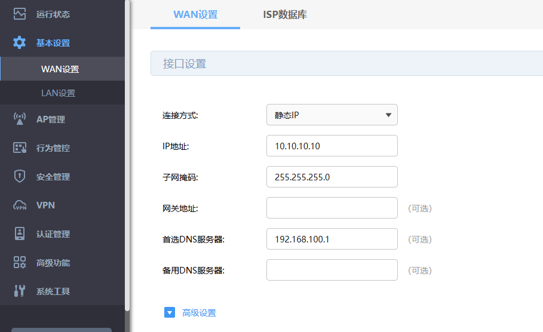
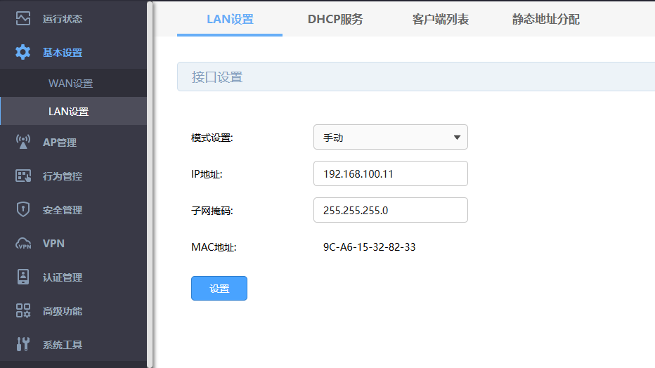
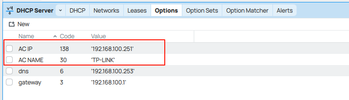
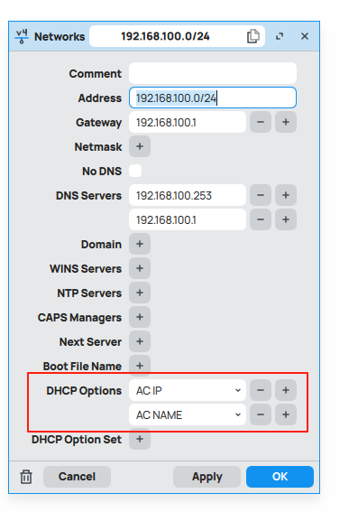

# 重新折腾家里的AC\AP
>
> tags：TPLINK, TP-LINK, AC, AP

## 前因
自从有了软路由以后，一直就想将家里的无线客户端也被软路由的DHCP纳管，但一直没有方案，一直还是将原来的硬路由作为二级路由来使用了。
最近看到一篇将`TL-R479GP-AC`当作单AC的文章，就来试试

## 设置 TL-R479GP-AC
1. 先将`TL-R479GP-AC`给reset了，这样方便配置
2. 将一根网线分别插到主路由和`TL-R479GP-AC`的LAN口，这里我们就不用WAN了
3. 直接跳过初始化，全部手动配置，不然他会要求配置一个WAN口，必须有网关，后面配置就不方便了
4. 设置一下WAN，只配置IP地址和掩码

5. 设置LAN口IP，这里的IP需要在软路由的LAN同网段下，模式设置为手动，不然他会自动配置成192.168.1.1

6. 关闭DHCP服务，开着会影响主路由的DHCP
7. 设置AP和WIFI，这步骤和正常操作一样

## 设置Routeros
1. 增加两个DHCP OPTION，分别是：

    `60`: `TP-LINK` 供应商标识，表示AP用TP-LINK标识找AC

    `138`: `192.168.100.11` 指定AC地址，让AP去找AC
    
    
2. 在dhcp-network里填上上面新建的option

## 验收
最后就可以去看AP是否自动加入到AC管理
无线网络的客户端是不是通过routeros的dhcp下发了地址。